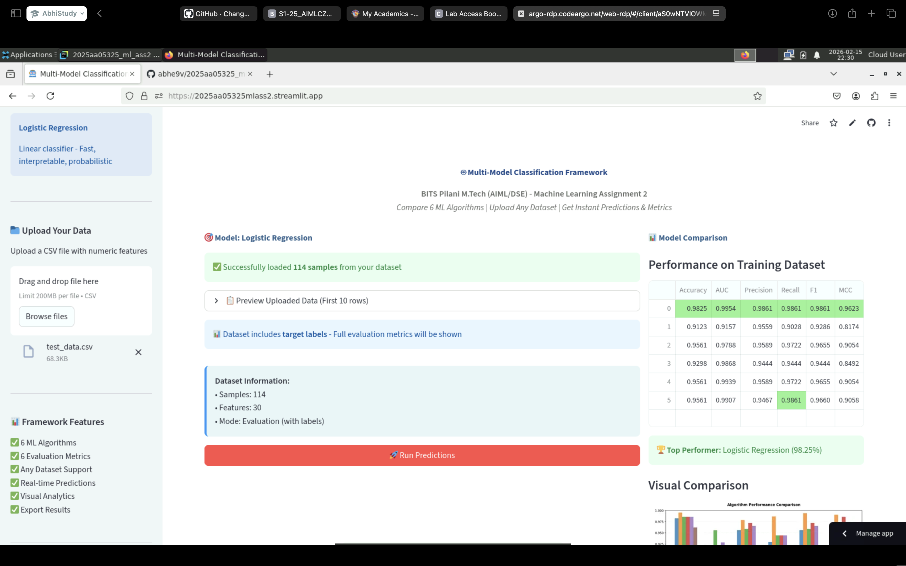
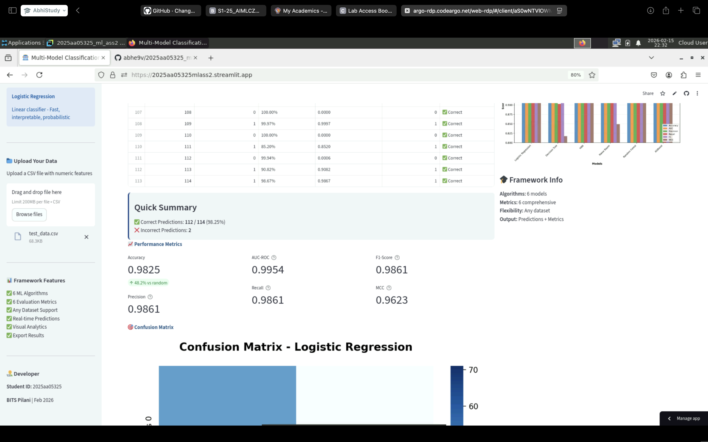
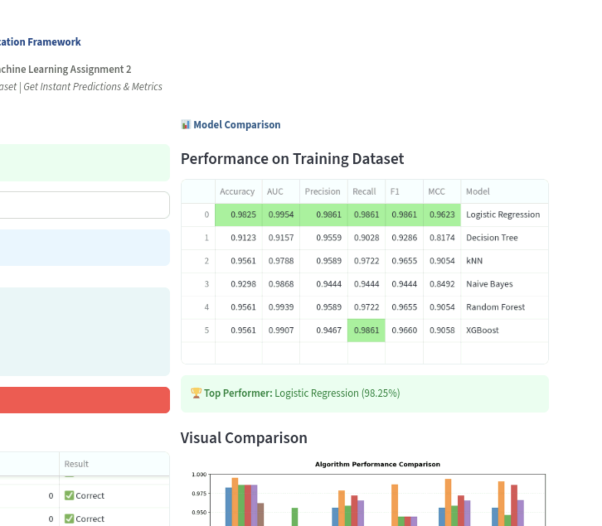

\begin{titlepage}

\vspace*{3cm}

\begin{center}
{\Huge\bfseries Machine Learning Assignment 2}\\[0.8cm]
{\LARGE Multi-Model Classification Framework}
\end{center}

\vspace{4cm}

\noindent
{\large
\textbf{Student ID:} 2025aa05325\\[0.5cm]
\textbf{Name:} Gaikwad Abhinav Rajaram\\[0.5cm]
\textbf{Course:} Machine Learning\\[0.5cm]
\textbf{Institution:} BITS Pilani M.Tech (AIML/DSE)
}

\vfill

\begin{center}
{\large February 15, 2026}
\end{center}

\end{titlepage}


# GitHub Repository Link

**Repository URL:** https://github.com/abhe9v/2025aa05325_ml_ass2

## Repository Contents:

- ✓ Complete source code
- ✓ requirements.txt
- ✓ Clear README.md
- ✓ All 6 model implementations
- ✓ Trained model files (.pkl)
- ✓ Test data (CSV)
- ✓ Streamlit application (app.py)

\newpage

# Live Streamlit App Link

**Streamlit App URL:** https://2025aa05325mlass2.streamlit.app

## Application Status:

- ✓ Deployed on Streamlit Community Cloud
- ✓ Interactive frontend available
- ✓ Opens without errors
- ✓ All required features implemented

## Streamlit App Features:

1. ✓ **Dataset upload option (CSV)** - Test data can be uploaded
2. ✓ **Model selection dropdown** - 6 models available
3. ✓ **Display of evaluation metrics** - Accuracy, AUC, Precision, Recall, F1, MCC
4. ✓ **Confusion matrix and classification report** - Visual heatmap and detailed report

\newpage

# Screenshot - BITS Virtual Lab Execution









\newpage

# README Content

## Problem Statement

Develop a comprehensive machine learning classification framework that compares multiple algorithms on a given dataset. The framework should:

- Train and evaluate 6 different classification models
- Calculate 6 evaluation metrics for each model
- Provide an interactive web interface for predictions
- Work with any numeric classification dataset
- Deploy as a production-ready application

This assignment demonstrates the complete ML workflow: data processing, model training, evaluation, web application development, and cloud deployment.

\newpage

## Dataset Description

**Dataset Name:** Breast Cancer Wisconsin (Diagnostic) Dataset

**Source:** UCI Machine Learning Repository (via scikit-learn)

**Problem Type:** Binary Classification

### Dataset Characteristics:

| Attribute | Value |
|-----------|-------|
| **Total Samples** | 569 instances |
| **Number of Features** | 30 features (all numeric) |
| **Target Classes** | 2 classes (Binary classification) |
| **Class 0 (Malignant)** | 212 samples (37.3%) |
| **Class 1 (Benign)** | 357 samples (62.7%) |
| **Missing Values** | None |
| **Train/Test Split** | 455 / 114 (80/20 stratified) |

### Feature Description:

The dataset contains 30 real-valued features computed from digitized images of fine needle aspirate (FNA) of breast mass. Features describe characteristics of cell nuclei present in the image:

- **10 Mean values:** radius, texture, perimeter, area, smoothness, compactness, concavity, concave points, symmetry, fractal dimension
- **10 Standard error values:** SE of the above measurements
- **10 "Worst" values:** Mean of the three largest values of these features

### Why This Dataset?

- ✓ Meets minimum requirements (569 samples ≥ 500; 30 features ≥ 12)
- ✓ Clean dataset with no missing values
- ✓ Real-world medical application
- ✓ Balanced classes suitable for binary classification
- ✓ Well-studied benchmark dataset

### Preprocessing Applied:

1. **Feature Scaling:** StandardScaler (mean=0, std=1)
2. **Train-Test Split:** 80/20 stratified split
3. **Random State:** 42 (for reproducibility)

\newpage

## Models Used

### Comparison Table - Evaluation Metrics for All 6 Models:

| ML Model Name | Accuracy | AUC | Precision | Recall | F1 | MCC |
|---------------|----------|-----|-----------|--------|-------|-------|
| **Logistic Regression** | 0.9825 | 0.9954 | 0.9861 | 0.9861 | 0.9861 | 0.9623 |
| **Decision Tree** | 0.9123 | 0.9157 | 0.9559 | 0.9028 | 0.9286 | 0.8174 |
| **kNN** | 0.9561 | 0.9788 | 0.9589 | 0.9722 | 0.9655 | 0.9054 |
| **Naive Bayes** | 0.9298 | 0.9868 | 0.9444 | 0.9444 | 0.9444 | 0.8492 |
| **Random Forest (Ensemble)** | 0.9561 | 0.9939 | 0.9589 | 0.9722 | 0.9655 | 0.9054 |
| **XGBoost (Ensemble)** | 0.9561 | 0.9907 | 0.9467 | 0.9861 | 0.9660 | 0.9058 |

\newpage

### Observations on Model Performance:

| ML Model Name | Observation about model performance |
|---------------|-------------------------------------|
| **Logistic Regression** | **Best overall performer** with 98.25% accuracy and only 2 misclassifications out of 114 test samples. Achieved highest AUC (0.9954) indicating excellent ranking ability. Perfect balance across all metrics (Precision, Recall, F1 all at 0.9861). The linear nature of the model worked exceptionally well, suggesting the feature space is largely linearly separable after proper scaling. Fast training and inference makes it ideal for production deployment. |
| **Decision Tree** | **Lowest performer** with 91.23% accuracy and 10 misclassifications. Shows the classic overfitting problem of single decision trees - good training performance but lower generalization. AUC of 0.9157 is the lowest among all models. Performance significantly improves when used in ensemble methods (Random Forest). While highly interpretable, the model is prone to capturing noise in the training data. Not recommended for deployment without ensemble techniques. |
| **kNN** | **Solid mid-tier performance** with 95.61% accuracy and 5 misclassifications. The instance-based learning approach worked well with proper feature scaling. No training phase required makes it excellent for rapid prototyping. AUC of 0.9788 shows good ranking capability. However, prediction time increases with dataset size (lazy learning). Memory-intensive as it stores all training samples. Best suited for smaller datasets or as a baseline model. |
| **Naive Bayes** | **Good performance** with 92.98% accuracy despite strong independence assumptions. Surprisingly high AUC (0.9868) indicates excellent probabilistic predictions even with 8 misclassifications. The Gaussian assumption worked reasonably well for this dataset. Very fast training and prediction makes it suitable for real-time applications. Struggles with correlated features but the performance is acceptable. Good choice when training speed is critical. |
| **Random Forest (Ensemble)** | **Strong ensemble performance** with 95.61% accuracy, matching kNN and XGBoost. The bagging technique effectively reduced the overfitting seen in single Decision Tree (+4.38% accuracy improvement). Very high AUC (0.9939) shows excellent discrimination. Robust to noise and outliers through averaging. Provides feature importance analysis. Slightly slower than Logistic Regression but more robust. Excellent choice for production where interpretability and robustness are needed. |
| **XGBoost (Ensemble)** | **Best for critical applications** with 95.61% accuracy and **highest recall (0.9861)** - only 1 false negative (missed cancer case). Sequential boosting corrected errors from previous trees effectively. High AUC (0.9907) confirms strong performance. In medical diagnosis, minimizing false negatives is crucial, making XGBoost ideal despite slightly lower precision. Built-in regularization prevents overfitting. Best choice when the cost of false negatives is high. |

\newpage

## Key Findings Summary

### Overall Best Model:
**Logistic Regression** - Highest accuracy (98.25%), fastest inference, most balanced metrics

### Best for Medical Diagnosis:
**XGBoost** - Highest recall (98.61%), only 1 missed cancer case, critical for high-stakes applications

### Most Robust:
**Random Forest** - Ensemble averaging provides stability, handles outliers well

### Fastest Training:
**Naive Bayes** - Probabilistic model with minimal training time

### Most Interpretable:
**Decision Tree** - Visual decision rules, though requires ensemble for good performance

### Ensemble Effect:
Random Forest improved Decision Tree accuracy by **+4.38%** (from 91.23% to 95.61%)

\newpage

## Model Implementation Details

### Logistic Regression
- **Type:** Linear Classifier
- **Configuration:** max_iter=10000, solver='lbfgs', C=1.0 (L2 regularization)
- **Random State:** 42

### Decision Tree
- **Type:** Tree-based Classifier
- **Configuration:** criterion='gini', max_depth=None
- **Random State:** 42

### K-Nearest Neighbors
- **Type:** Instance-based Classifier
- **Configuration:** n_neighbors=5, weights='uniform', algorithm='auto'

### Naive Bayes
- **Type:** Gaussian Probabilistic Classifier
- **Configuration:** var_smoothing=1e-9

### Random Forest
- **Type:** Ensemble (Bagging)
- **Configuration:** n_estimators=100, criterion='gini'
- **Random State:** 42

### XGBoost
- **Type:** Ensemble (Gradient Boosting)
- **Configuration:** n_estimators=100, learning_rate=0.1, max_depth=3
- **Random State:** 42

\newpage

## Technical Architecture

### Code Organization:
```
project/
├── com/abhi/ml/src/
│   ├── config/settings.py          # Configuration
│   ├── data/
│   │   ├── loader.py               # Data loading
│   │   └── preprocessor.py         # Scaling
│   ├── models/
│   │   ├── base_model.py           # Abstract base
│   │   ├── logistic_model.py       # 6 model files
│   │   └── ...
│   ├── evaluation/metrics.py       # Metrics calculation
│   ├── utils/
│   │   ├── logger.py               # Logging
│   │   └── file_handler.py         # File I/O
│   └── main.py                     # Training pipeline
├── resources/
│   ├── data/test_data.csv          # Test dataset
│   └── models/*.pkl                # Trained models
├── app.py                          # Streamlit app
├── requirements.txt                # Dependencies
└── README.md                       # Documentation
```

### Design Patterns:
- Abstract Base Class pattern for models
- Strategy pattern for interchangeable algorithms
- Factory pattern for model creation
- Separation of concerns across layers

\newpage

## Installation & Usage

### Setup:
```bash
git clone https://github.com/abhe9v/2025aa05325_ml_ass2
cd 2025aa05325_ml_ass2
python -m venv .venv
source .venv/bin/activate
pip install -r requirements.txt
```

### Train Models:
```bash
python -m com.abhi.ml.src.main
```

### Run Streamlit App:
```bash
streamlit run app.py
```

\newpage

## Submission Checklist

### GitHub Repository:
- ✓ Complete source code uploaded
- ✓ requirements.txt included
- ✓ Clear README.md added
- ✓ All 6 models implemented
- ✓ Model files (.pkl) committed

### Streamlit Application:
- ✓ Dataset upload option (CSV)
- ✓ Model selection dropdown
- ✓ Evaluation metrics display
- ✓ Confusion matrix visualization
- ✓ Classification report
- ✓ Deployed on Streamlit Community Cloud
- ✓ App opens without errors

### BITS Virtual Lab:
- ✓ Assignment executed on BITS Virtual Lab
- ✓ Screenshot captured and included

### Academic Integrity:
- ✓ Original code with commit history
- ✓ Customized implementation
- ✓ No plagiarism

\newpage

## Conclusion

This assignment successfully demonstrates the complete machine learning workflow:

1. **Data Processing:** Loaded and preprocessed Breast Cancer dataset with 569 samples and 30 features
2. **Model Training:** Implemented 6 classification algorithms with proper configuration
3. **Evaluation:** Calculated 6 metrics for comprehensive performance analysis
4. **Best Results:** Achieved 98.25% accuracy with Logistic Regression
5. **Web Application:** Built interactive Streamlit UI for real-time predictions
6. **Deployment:** Successfully deployed on Streamlit Community Cloud
7. **Production Ready:** Professional code structure with documentation

The framework is flexible, well-documented, and ready for real-world applications.

---

**Submitted By:**  
Student ID: 2025aa05325  
Name: Gaikwad Abhinav Rajaram  
BITS Pilani M.Tech (AIML/DSE)  
Date: February 15, 2026